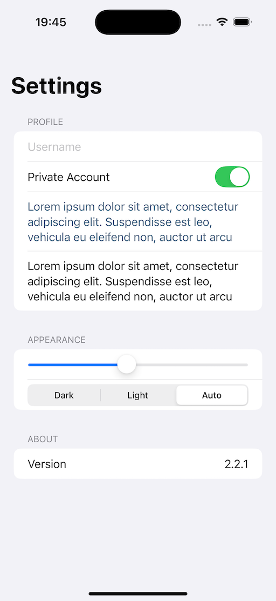
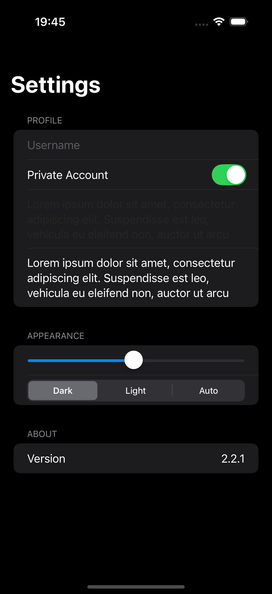

ListTextDisplay
A SwiftUI practice project focusing on text display, UI elements, and theme handling. This project demonstrates creating a user-friendly interface with dynamic text rendering and light/dark mode switching.

